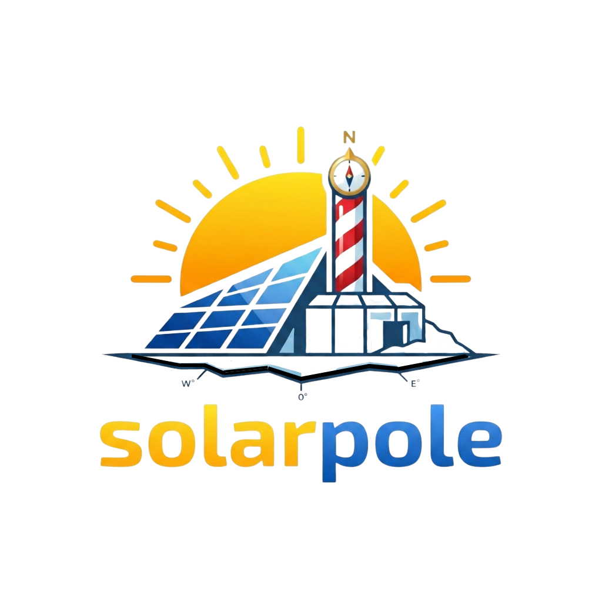
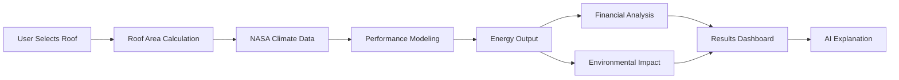

<p align="center">
  
</p>

<h1 align="center">☀️ SolarVision</h1>

<p align="center">
  <strong>AI-Powered Rooftop Solar Analysis Platform</strong><br/>
  Analyze rooftop solar potential instantly using <b>satellite data, climate intelligence, and AI</b>.
</p>

<p align="center">
  <a href="https://solarvision.vercel.app">🌐 Live Demo</a>
  &nbsp;·&nbsp;
  <a href="https://github.com/Hamdan772/SolarVision">⭐ Star on GitHub</a>
</p>

<p align="center">
  
  
  
  
</p>

---

## 🎯 What is SolarVision?

**SolarVision** is a free, AI-powered web platform that helps homeowners, businesses, and policymakers instantly evaluate **rooftop solar potential** anywhere in the world.

---

## 🚨 The Problem

Most people don’t know whether solar is worth it for their specific roof. Traditional solar assessments are:

- 💸 **Expensive** — $100–$500 per consultation  
- 🔒 **Technical** — confusing jargon and spreadsheets  
- 🌍 **Limited** — unavailable in many regions  

---

## ✅ The Solution

SolarVision democratizes solar decision-making by combining:

- 🛰️ **Satellite imagery** for accurate rooftop selection  
- ☀️ **6 years of NASA climate data** for precise energy modeling  
- 🤖 **AI assistant** for personalized explanations  
- 📊 **Financial modeling** (ROI, LCOE, IRR, NPV, payback period)  
- ⚡ **Energy generation estimates** with degradation modeling  
- 🌱 **Environmental impact metrics** (CO₂ reduction, trees, cars off road)

**Result:** Instant, accurate, and free rooftop solar analysis — anywhere.

---

## ✨ Features

| Feature | Description |
|----------|-------------|
| 🗺️ **Interactive Map** | Select rooftops using satellite imagery with OpenStreetMap building detection |
| ☀️ **Energy Analysis** | Monthly & annual generation using NASA POWER irradiance data |
| 💰 **Financial ROI** | DEWA-tiered rates, LCOE, IRR (Newton-Raphson), 25-year NPV |
| 🌱 **Impact Metrics** | CO₂ reduction, tree equivalents, cars-off-road equivalents |
| 🤖 **AI Assistant** | Powered by Groq LLaMA 3.3 70B |
| 📄 **PDF Reports** | Professional downloadable reports |
| 🌗 **Light & Dark Mode** | OS preference detection with full theme sync |
| 🎨 **Premium UI** | Glass morphism, smooth animations |
| 📱 **Mobile Responsive** | Fully optimized layout |
| 🔄 **Expand Mode** | Full-screen analysis dashboard |

---

## 🛠️ Tech Stack

| Layer | Technology |
|-------|-------------|
| Frontend | HTML5, CSS3 (Glass Morphism), Vanilla JavaScript |
| Mapping | Leaflet.js, OpenStreetMap, Google Satellite, Turf.js |
| AI | Groq LLaMA 3.3 70B (via serverless proxy) |
| Climate Data | NASA POWER API |
| Backend | Python 3, Vercel Serverless Functions |
| PDF | jsPDF, html2canvas |
| Deployment | Vercel |

---

## 📊 How It Works



---

## 🏜️ UAE Climate Optimization

SolarVision is tuned for **hot-desert environments (UAE)**.

| Parameter | Value |
|-----------|--------|
| Electricity Rate | 0.38 AED/kWh (DEWA Slab 2) |
| Dust/Soiling Loss | 4% |
| Cloud Factor | 95% |
| Optimal Tilt | 25° |
| System Efficiency | 84% |
| Panel Degradation | 0.5% / year |
| CO₂ Factor | 0.42 kg/kWh |

---

## 🚀 Quick Start

### Installation

```bash
git clone https://github.com/Hamdan772/SolarVision.git
cd SolarVision
cp .env.example .env
# Add your GROQ_API_KEY
python server_local.py
```

### Local Access

| Page | URL |
|------|------|
| Landing Page | http://localhost:8000/index.html |
| Calculator | http://localhost:8000/solar_advanced.html |
| AI Proxy | http://localhost:8000/api/groq |

---

## 🗺️ Roadmap

### ✅ Phase 1 — Complete
- UAE-optimized calculator
- Satellite rooftop selection
- AI assistant
- Financial & environmental modeling
- PDF generation
- Premium UI

### 🚧 Phase 2 — 2026
- Global region support
- Progressive Web App
- Shading analysis
- Battery recommendations

### 🔮 Phase 3 — Future
- 3D roof modeling
- Installer marketplace
- Real-time monitoring
- Multi-language support

---

## 🌍 UN Sustainable Development Goals

| Goal | Description |
|------|--------------|
| **SDG 7** | Affordable & Clean Energy |
| **SDG 11** | Sustainable Cities |
| **SDG 12** | Responsible Consumption |
| **SDG 13** | Climate Action |

---

## 🤝 Contributing

```bash
git checkout -b feature/amazing-feature
git commit -m "Add amazing feature"
git push origin feature/amazing-feature
```

Open a Pull Request 🚀

---

## 📝 License

This project is licensed under the **MIT License**.

---

<p align="center">
  <strong>⭐ Star this repo if you find it useful!</strong><br/>
  Built with ☀️ for a sustainable future.
</p>
